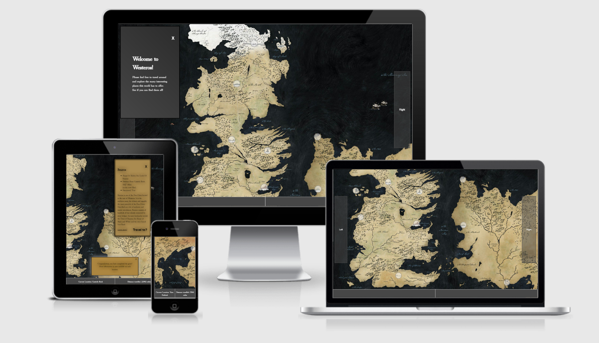
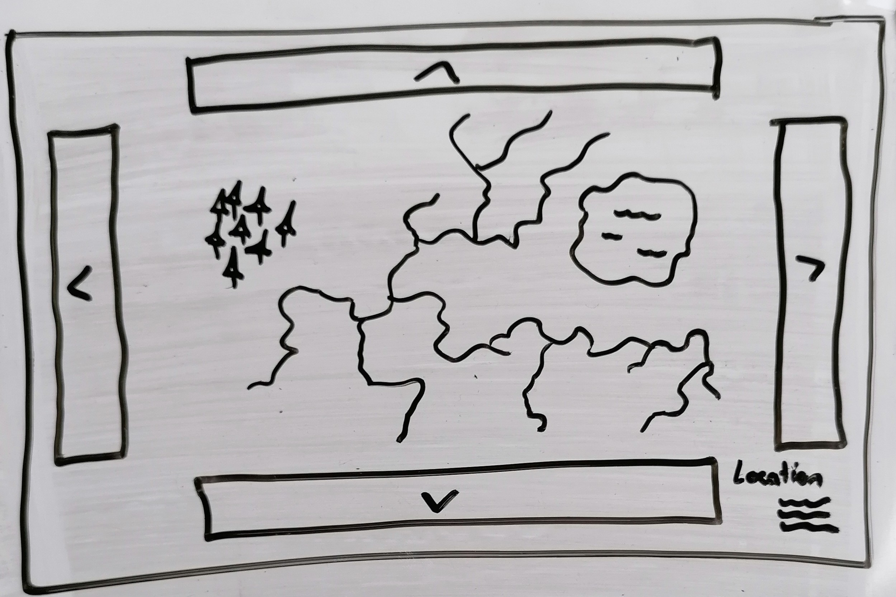
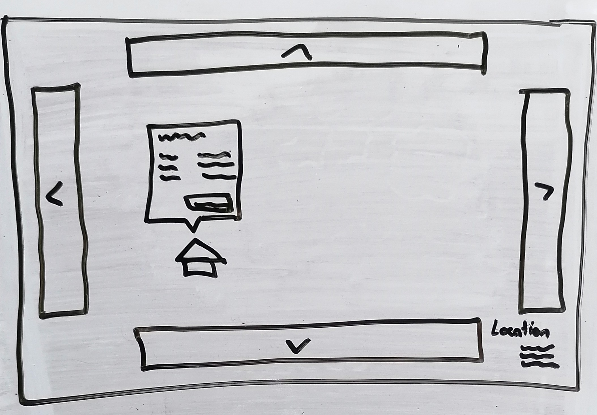
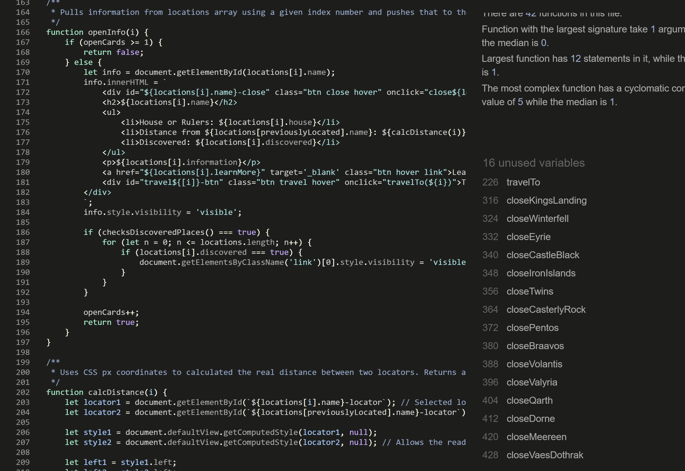
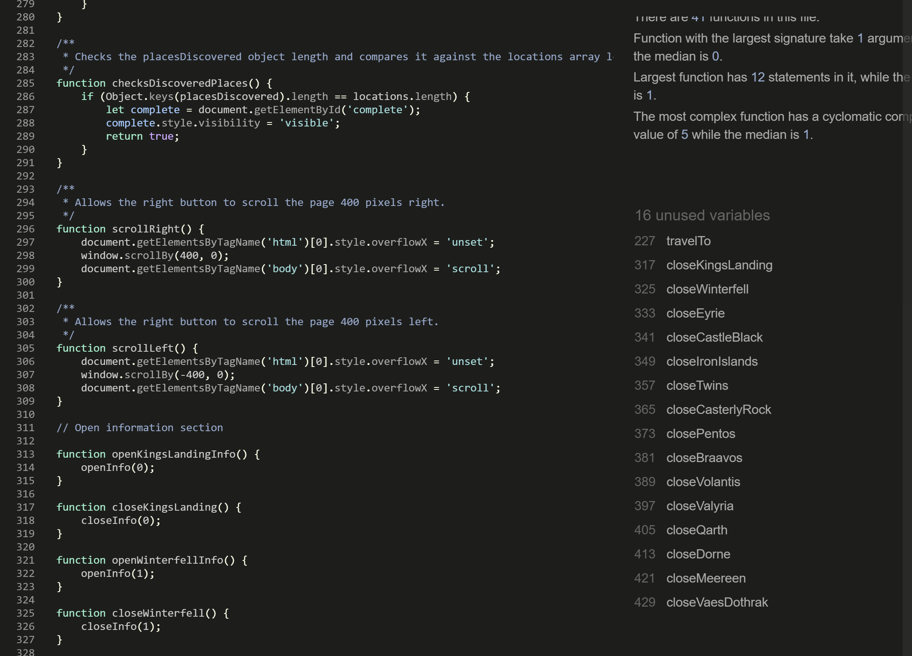
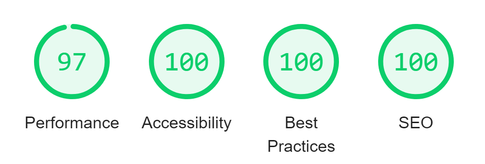

# Game Of Thrones Interactive Map Game

This Game of Thrones interactive map game is designed to provide information to the player in a fun way. The clickable locations reveal various information to the player and allow them to 'travel' to each location. An interesting aspect of this is each card will show the 'in-world' distance to any other location on the map. At the end of the game, once all the locations have been discovered, more information is available on each card that links to an external site.

## User Experience (UX)

### User Stories           
- First time visitor goals:
  - To find an interesting, interactive map of the world of Game of Thrones containing accurate information and locations.

- Returning visitor goals:
  - To test and improve trivial knowledge of the world and locations.

- Frequent user goals:
  - To see the map be updated with more locations over time, perhaps separated into larger, main locations, and smaller, world-building locations.

- Site owner goals: 
  - To provide a fun, interactive, informative map depicting the world of Game of Thrones, and continue to update the map with more locations and to make those updates easy to impliment.

### Design
- Color Scheme
  - Old, worn, rustic design in keeping with the age of the world.

- Typography
  - Hina Mincho used primarily as due to its old, worn, but still formal typeface.

- Imagery
  - The map used is of the fictional world of Westeros and Essos created by author George R. R. Martin and is the copywrite material of said author and HBO.

- Wireframes 
  - General map with arrows to navigate and the location displayed in the bottom corner.
  
  - Information card above a location.
  

<!-- HTML used instead of markdown to control image size as images were very large when testing. -->

## Features

### Existing features
- Interactive elements.
- Responsive design for all screen sizes.
- Links to external sources for information.

### Landing Page
- The page loads with a map of the world and a card explaining the site's intent.
- Clickable locations that reveal information cards with various facts about each location including the distance from said location to the previous location travelled to. 

## Features to be implimented

## Languages Used

- HTML5
- CSS3
- JavaScript

## Frameworks used

- [Google Fonts](https://fonts.google.com/)
- Git
- GitHub
- [PicResize](https://picresize.com/)

## Adding a new location 

- To add a new location all three files need to be updated.
  - HTML
    - < div id="location-name-locator" class="locator hover">Location Name< /div > 
      < div id="location-name" class="location">< /div >
  - CSS
    - #location-name { 
      top: (num)px; 
      left: (num)px; 
      }

    - #location-name-locator { 
      top: (num)px; 
      left: (num)px; 
      }
  
    - The CSS top and left coordinates must be static (px). Relative units will alter location and distances as the screen size changes.

  - JavaScript
    - In the locations array, add an object containing:
      - { 
        index: x,
          
        function: 'LocationName',  
        *in camelCase assuming starting at the second word
          
        name: 'location-name',
          
        house or rulers: '',
          
        information: 'Lorem ipsum',
          
        currentlyLocated: false,
          
        discovered: false, 
        },  

    - In the open info functions section, add:  
      - function openLocationNameInfo() { 
        openInfo(x); 
        }
          
        function closeLocationName() { 
        closeInfo(x); 
        } 
    
    - In the Event Listener section, add: 
      - document.getElementById('location-name-locator').addEventListener('click',          openLocationNameInfo);

## Testing

- The original project was constructed on a laptop with a screen size of 12.3 inches. The code was also put through W3C validators and passed through without any issues.

  - [W3C Markup Validator](https://validator.w3.org/nu/?doc=https%3A%2F%2Fryan-b1yth.github.io%2Fwelcome-to-westeros%2F)

  - [W3C CSS Validator](https://jigsaw.w3.org/css-validator/validator?uri=https%3A%2F%2Fryan-b1yth.github.io%2Fwelcome-to-westeros%2F&profile=css3svg&usermedium=all&warning=1&vextwarning=&lang=en)

  - Javascript Validator - JShint
  
  

  - Unused functions flagged in the validator are used but can only be accessed after firing other functions first. All unused functions are contained within the openInfo function.

### Known bugs

## Further testing
- The site was tested on Google Chrome using their developer tools and viewed on Firefox, Microsoft Edge, and Safari to ensure it worked across multiple platforms. During development, on changing the screen size and using the implimented Left and Right buttons the page reverted to the full size of the image, pushing the footer down and opening a large white space between the base of the image and the footer. However on actual use, this doesn't happen so I'm attributing this to the developer tools stuggling to scroll the window at an unexpected screen size. The site was also viewed on multiple devices of varying screen sizes and this continued to not be an issue in actual use.

- Google Chrome's DevTools Lighthouse:
  - Desktop
        
  - Mobile
        

## Deployment 
- The site was deployed to GitHub pages. The steps to deploy are as follows:
  - In the GitHub repository, navigate to the Settings tab.
  - Open the pages tab on the left hand side of the page.
  - From the source section drop-down menu, select the Master Branch.
  - Once the master branch has been selected, the page will be automatically refreshed with a detailed ribbon display to indicate the successful deployment.
<!-- Deployment code and content taken straight from Code Institutes README template -->

- You can view the live site [here](https://ryan-b1yth.github.io/welcome-to-westeros/).

## Credits 

### Code
- [Object.keys()](https://developer.mozilla.org/en-US/docs/Web/JavaScript/Reference/Global_Objects/Object/keys)

### Content
- Code
  - All code was written by the developer.

- Content
  - The world map was created by author George R. R. Martin and is the copywrite material of said author and HBO. The specific map used was sourced from [A Wiki of Ice and Fire](https://awoiaf.westeros.org/index.php/World_Map_(HBO_Game_Of_Thrones)) and all information was sourced from this [Game of Thrones Wiki](https://gameofthrones.fandom.com/wiki/Game_of_Thrones_Wiki).

### Acknowledgements
    
- Tutor support at Code Institute for all their support throughout.

- Friends and family for viewing the site and giving feedback.